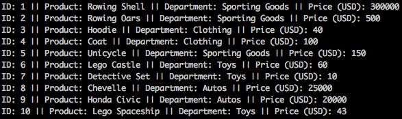

# **Bamazon**
 
## **Summary**
 
An interactive node app using MySQL, Node.JS, and various npm packages to all users to purchase items from the MySQL database. Users can purchase items and are informed if the purchase quantity they select is available.
 
To run the app a MySQL database is required with the followingitemitem
 
***
 
### **Customer Instructions**
 
Run the bamazonCustomer.js file in node to begin. A list of available products will be shown with the item ID, product name, department, and price. Determine what product you would like to purchase.
 

 
A prompt will ask for the product you would like to purchase. Enter the ID of the item you would like to purchase and press Enter.
 

 
A prompt will ask for the number of units you would like to purchase of the selected item. Enter a quantity number.

 
If the quantity is available you will be informed that your purchase is complete.

If the quantity you have entered is not available you will be informed that the quantity selected is unavailable.

***

## **Requirements**

##### [Node.JS](https://nodejs.org/en/download/)
##### [MySQL](https://www.mysql.com/downloads/)
##### [NPM Packages](https://www.npmjs.com)
* [Inquirer](https://www.npmjs.com/package/inquirer)
* [mysql](https://www.npmjs.com/package/mysql)

